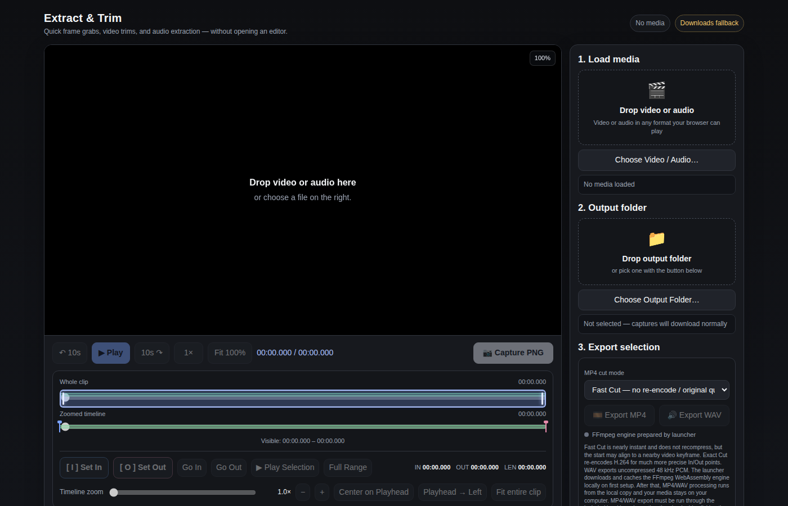
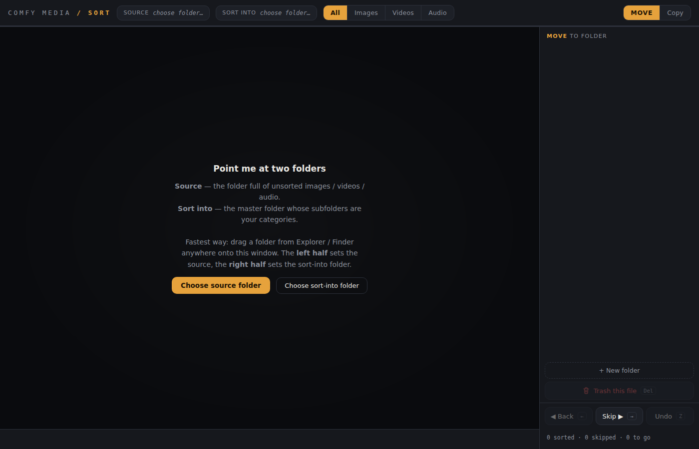
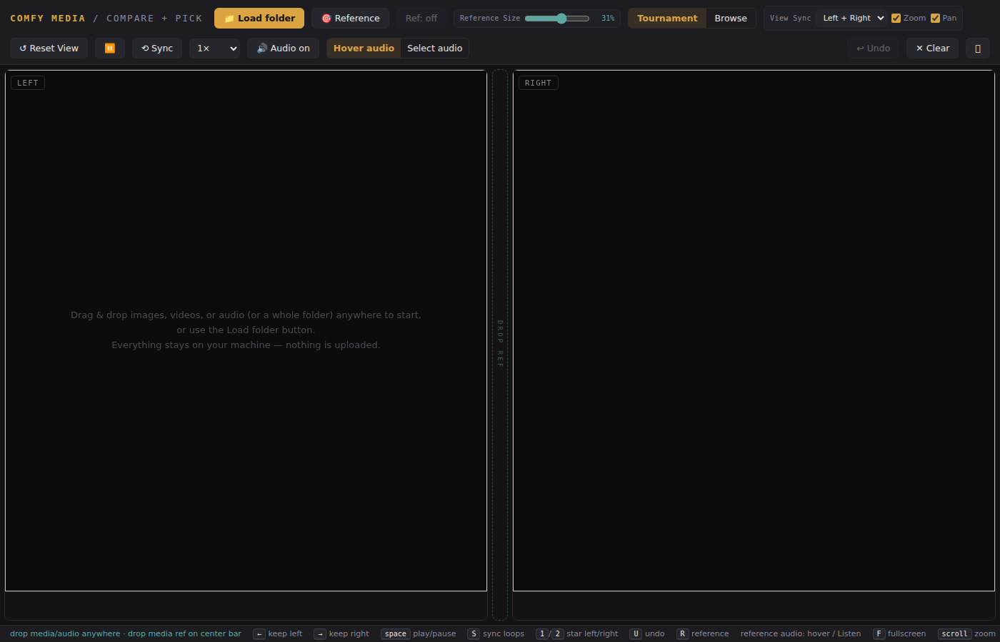

# ComfyUI Media Utility — User Guide

ComfyUI Media Utility is a lightweight local companion for the quick media tasks that often happen around a ComfyUI workflow: trimming a clip, extracting a frame or voice sample, sorting generations, or comparing multiple outputs without opening a full NLE or audio editor.

The app has three persistent workspaces:

- **Extract / Trim** — inspect media, grab PNG frames, set In/Out points, and export MP4 or WAV clips.
- **Sort** — rapidly route images, video, and audio into folders.
- **Compare** — compare image/video/audio candidates side by side, optionally against a reference.

Your workspace state stays alive while switching tabs during the same app session.

---

## 1. Getting started

### Requirements

- Windows 10 or 11
- Python 3
- Chrome or Edge recommended

Python is used only to run the local web server and prepare the optional FFmpeg browser engine. No pip packages, Node.js packages, virtual environment, or ComfyUI custom node installation is required.

### Launching the app

1. Extract the Windows release ZIP to a normal folder.
2. Double-click `Launch_ComfyUI_Media_Utility.bat`.
3. Leave the small command window open while using the app.
4. The utility opens automatically in your default browser.

The launcher serves the app from `127.0.0.1`, which means the web interface is running only on your own computer.

### First-run FFmpeg setup

The first time you launch the public release, the launcher attempts to download and cache the pinned ffmpeg.wasm files used for MP4/WAV export. The download is roughly 32 MB and is stored under `vendor/ffmpeg/`.

If FFmpeg setup fails, the rest of the utility still works. You can use Sort, Compare, playback, and PNG frame grabs, then retry later with:

`Setup_FFmpeg_Engine.bat`

---

## 2. Switching workspaces

Use the tabs across the top of the app, or use:

- `Alt+1` — Extract / Trim
- `Alt+2` — Sort
- `Alt+3` — Compare

Switching tabs does **not** reset the other workspace. For example, you can leave a Compare tournament in progress, jump to Extract / Trim to grab a frame, then return to the same comparison.

---

# Extract / Trim

Extract / Trim is meant for quick jobs that would otherwise make you open Premiere, Resolve, Audition, or another full editor.

## 3. Loading media

You can either:

- drag a video or audio file into the viewer, or
- click **Choose Video / Audio…**

For video, the viewer displays the frame and enables PNG capture. For audio-only input, video-specific controls are disabled automatically.

Browser playback codec support still applies, so a file can exist on disk but fail to preview if the browser does not support its codec.

## 4. Viewer zoom and pan

When inspecting video:

- Move the pointer over the video and use the **mouse wheel** to zoom toward that location.
- When zoomed in, **click-drag** to pan around the frame.
- Click **Fit 100%** to return to the normal full-frame view.
- Double-clicking the viewer while zoomed also resets the image view.

Viewer zoom affects only what you see. A PNG capture still exports the complete source frame at native source resolution.

## 5. Playback controls

The main transport provides:

- Rewind 10 seconds
- Play / Pause
- Forward 10 seconds
- Playback speed: 0.5× / 1× / 1.5× / 2×

Keyboard shortcuts:

- `Space` — Play / Pause
- `← / →` — move ±1 second
- `Shift + ← / →` — move ±10 seconds
- `C` — Capture PNG

## 6. Whole Clip timeline

The **Whole Clip** bar represents the entire source file and is useful for coarse navigation.

When timeline zoom is greater than 1×, the bright outlined overlay shows the exact portion of the clip represented by the precision timeline below it. The rest of the clip is dimmed so the active range is easy to see.

## 7. Zoomed timeline

The **Zoomed Timeline** gives you a much more precise scrub range inside a long video.

Use **Timeline zoom** to control how much of the source the precision timeline represents. For example, on a 20-minute video:

- 1× = 20 minutes visible
- 4× = about 5 minutes visible
- 10× = about 2 minutes visible
- 100× = about 12 seconds visible

The zoomed window is deliberately **locked** while you scrub. Dragging its playhead all the way to the left or right takes you only to that zoom window's boundary; it does not redefine the zoom window or jump to the beginning of the entire file.

### Center on Playhead

Click **Center on Playhead** to keep the same zoom amount but move the active timeline window so the current playhead is centered inside it.

This is useful when you have reached the right side of a precision range and want more material on both sides of the current position.

### Playhead → Left

Click **Playhead → Left** to keep the same zoom amount while making the current playhead the left side of the active precision range.

This is useful for progressively working forward through a long video: scrub near the end of the visible range, press **Playhead → Left**, and you now have a fresh span ahead of you at the same precision.

### Fit entire clip

Click **Fit entire clip** to return timeline zoom to 1×.

## 8. In and Out points

Move the playhead to the desired start and click **Set In**, or press `I`.

Move to the desired end and click **Set Out**, or press `O`.

The selected range is highlighted on the timelines and the exact In, Out, and duration values are shown.

Additional controls:

- **Go In** — jump to the In point
- **Go Out** — jump to the Out point
- **Play Selection** — play only the marked range
- **Full Range** — reset In/Out to the entire source

## 9. Capturing a PNG frame

Move the playhead to the desired frame and click **Capture PNG** or press `C`.

The frame is drawn directly from the source video element at its native dimensions. If the source is 3840×2160, the exported PNG is also 3840×2160 even if the on-screen viewer is much smaller or zoomed in.

If an output folder has been selected, the PNG is written there. Otherwise, the browser's normal download behavior is used.

## 10. Exporting WAV audio

Set In/Out, then click **Export WAV**.

The selected range is exported as uncompressed 48 kHz PCM WAV. This works with both video sources and audio-only sources.

## 11. Exporting MP4 clips

Set In/Out and choose an MP4 mode.

### Fast Cut

**Fast Cut** attempts to copy the source streams without re-encoding.

Advantages:

- very fast
- no generation loss from recompression

Tradeoff:

- the starting frame can align to a nearby source keyframe instead of the exact requested In point

If the source streams cannot be remuxed cleanly into MP4, the utility can fall back to H.264 encoding.

### Exact Cut

**Exact Cut** re-encodes the selected video to H.264 with AAC audio.

Advantages:

- much more precise In/Out behavior
- broadly compatible MP4 output

Tradeoff:

- slower than native desktop FFmpeg or an NLE because the encode is running through WebAssembly in the browser

## 12. Output folder

Click **Choose Output Folder…** to give the utility direct write access to a folder, or drag a supported directory into the output-folder target.

Chrome/Edge is recommended for this workflow because the direct writable-folder feature uses the File System Access API.

If direct folder access is unavailable, exports fall back to browser downloads.

---

# Sort

Sort is designed for quickly going through a large batch of ComfyUI outputs one item at a time and routing them into useful folders.

## 13. Choosing folders

The sorter uses two folder concepts:

- **Source** — the folder containing unsorted media.
- **Sort Into** — a master destination folder. Every subfolder inside it becomes a category button.

You can choose folders using the buttons at the top, or drag a folder into the app:

- drop on the left half to set **Source**
- drop on the right half to set **Sort Into**

## 14. Supported media

Sort supports:

- images
- videos
- audio

Use the top filter to display:

- All
- Images
- Videos
- Audio

Video and audio preview automatically when browser autoplay policy allows it.

## 15. Move vs Copy

Choose **Move** when the current source file should be relocated into a category.

Choose **Copy** when the original should stay in the source folder and a duplicate should be created in the destination category.

The current mode changes the accent color so it is visually obvious which action category buttons will perform.

## 16. Sorting into categories

Each subfolder inside the **Sort Into** directory appears as a category button in the right sidebar.

Click a category button to route the current file there, or use the hotkey shown on that category.

Available category hotkeys are assigned in order using:

`1 2 3 4 5 6 7 8 9 0 Q W E R T Y U I O P`

This makes it possible to sort large batches almost entirely from the keyboard.

## 17. New folders

Click **+ New folder** to create another category directly from the sorter. It immediately becomes available as a destination button.

## 18. Skip, Back, Trash, and Undo

- **Skip** — leave this item unresolved and move forward.
- **Back** — return to an earlier item.
- **Trash this file** — moves the current item into a `Trash` folder inside the source folder rather than permanently deleting it.
- **Undo** — reverses the most recent move, copy, or trash action when possible.

The Trash workflow is deliberately recoverable rather than destructive.

---

# Compare

Compare is intended for judging multiple generations visually and/or by audio without repeatedly opening files in separate players.

## 19. Loading candidates

Click **Load folder** and choose a folder of images, videos, and/or audio files.

The app presents candidates in Left and Right panes.

## 20. Tournament mode

Tournament mode is designed to reduce a large batch to a favorite.

Choose **Keep this one** on the Left or Right candidate. The loser is replaced by the next file until the comparison reaches a winner.

Keyboard shortcuts:

- `←` — Keep Left
- `→` — Keep Right
- `U` — Undo last pick

## 21. Browse mode

Browse lets you move through loaded files independently on each side instead of eliminating candidates.

Useful browse shortcuts are shown in the footer.

## 22. Reference media

The center Reference pane can contain:

- an image
- a video
- an audio file

Click **Reference** or drop reference media onto the center reference target.

Use **Ref: on/off** or `R` to show or hide it.

### Reference Size

Use the **Reference Size** slider in the fixed top toolbar to make the center Reference panel smaller or larger without moving the slider itself.

The selected width is remembered between sessions.

## 23. Zoom and pan

For visual media:

- mouse wheel — zoom
- click-drag — pan
- double-click — reset the linked view group
- **Reset View** or `0` — reset all visible panes to normal fit/center without clearing the comparison

## 24. View Sync

**View Sync** controls which panes share zoom/pan changes.

### Left + Right — default

Left and Right candidates are linked. The Reference is independent.

This is usually the best choice when comparing two generations against a reference that may have different framing.

### All 3

Left, Reference, and Right all participate in linked view changes.

### None

Every pane is completely independent.

### Zoom and Pan toggles

Zoom and Pan synchronization can be enabled independently.

Examples:

- **Left + Right + Zoom + Pan** — candidates stay fully locked together, Reference is independent.
- **Left + Right + Zoom only** — candidate magnification stays matched, but each candidate can be framed independently.
- **None** — every pane has its own zoom and pan.

Your View Sync choice is remembered.

## 25. Video/audio playback

Use the main Play/Pause control or press `Space`.

Additional controls include:

- playback rate
- loop synchronization (`S`)
- master audio on/off

## 26. Auditioning audio

Compare has two audio routing modes so multiple videos/audio files do not play over each other.

### Hover Audio

Whichever of Left, Reference, or Right you hover becomes the audible pane. The other panes stay muted.

This is useful for rapidly A/B/C checking voice similarity, sound design, or generated dialogue.

### Select Audio

Each pane containing audio/video gets a **Listen** control. Click Left, Reference, or Right to choose the single pane you want to hear.

This is useful when you want the active source to remain audible even after moving the pointer elsewhere.

## 27. Shortlist

Press `1` to shortlist Left or `2` to shortlist Right, or use the star controls.

The shortlist persists through the current comparison and can be used to keep strong candidates while continuing the tournament.

## 28. Winner screen

When a tournament finishes, the winner screen lets you:

- copy the filename
- browse loaded media
- run a finalist runoff when available
- send the winner / shortlist to a destination folder
- **Run it again** with the same loaded candidates
- start a **New compare** with a clean comparison state

**New compare** clears the current candidates, shortlist, winner, reference, and current destination while keeping general UI preferences such as View Sync and Reference Size.

## 29. Sending winners

Choose or drag a destination folder on the winner screen, then select Copy or Move.

The app avoids overwriting an existing filename by generating a unique destination name when necessary.

---

# Troubleshooting

## 30. MP4/WAV buttons say FFmpeg is unavailable

Close the app and run:

`Setup_FFmpeg_Engine.bat`

Then relaunch with `Launch_ComfyUI_Media_Utility.bat`.

## 31. The browser will not let me choose/write to folders

Use a current Chrome or Edge build and launch through the included BAT file rather than double-clicking the HTML files directly.

Browser permission prompts may need to be accepted again after a browser restart.

## 32. A video does not preview

The browser must support the video's codec. Rewrapping or converting the file to a browser-friendly H.264/AAC MP4 usually resolves preview problems.

## 33. Audio does not autoplay

Browsers can block autoplay with sound until the page has received a user interaction. Click anywhere in the app or press Play once, then retry.

## 34. Exact MP4 export is slow

Exact Cut performs H.264 encoding in WebAssembly. For quick clip extraction, use Fast Cut whenever frame-exact starts are not required.

## 35. Large files

Very large/long media can consume substantial browser memory during re-encoding. The utility is intended primarily for quick media operations rather than replacing a full desktop editor for heavy projects.

---

# Privacy and local operation

The app itself runs locally and source media is processed locally in the browser.

Your images, video, and audio are not uploaded by ComfyUI Media Utility.

Network access is used only to download or repair the pinned FFmpeg browser-engine files when they are not already cached locally.
